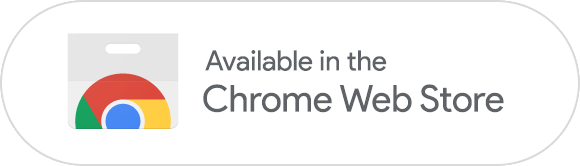
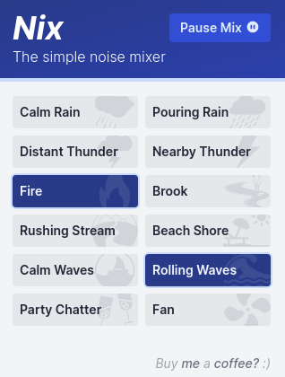
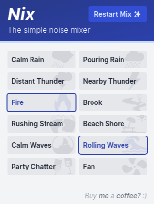

# Nix - the simple noise mixer 

---

`Nix` is the simple noise mixer browser extension - create your perfect mixture of sounds to help productivity and focus. It's simple, intuitive, and clean so that getting into a flow state is just a click away.

**Screenshots**

|              Nix while playing               |              Nix while paused              |
| :------------------------------------------: | :----------------------------------------: |
|  |  |

This extension is open source and licensed under the MIT license, so you can feel free to check out the source code at the extension home page or even contribute to make it better!

Enjoy the extension and feel like saying thanks? Feel free to [buy me a coffee ☕](https://www.paypal.me/fluencyy)

## Release Notes

See the [Release Notes](CHANGELOG.md) for details about changes in each release.

## License

This project is licensed under the MIT License - see the [license file](LICENSE) for details.

## Contact

If you have questions, problems or ideas, feel free to contact me at <a href="mailto:contact@fluencyy.com">contact@fluencyy.com</a>.

## Building Locally

To build the extension locally for development or testing:

1. Install `node` (and `npm`)
2. `cd` into the project root directory and `npm install`
3. Run `npm run dev:chrome` or `npm run dev:firefox` to build the development version of the extension for Chrome and Firefox (output to the `extensions` directory) with live file reloading.
4. Add the extension to your browser following normal procedure for loading an unpacked extension
